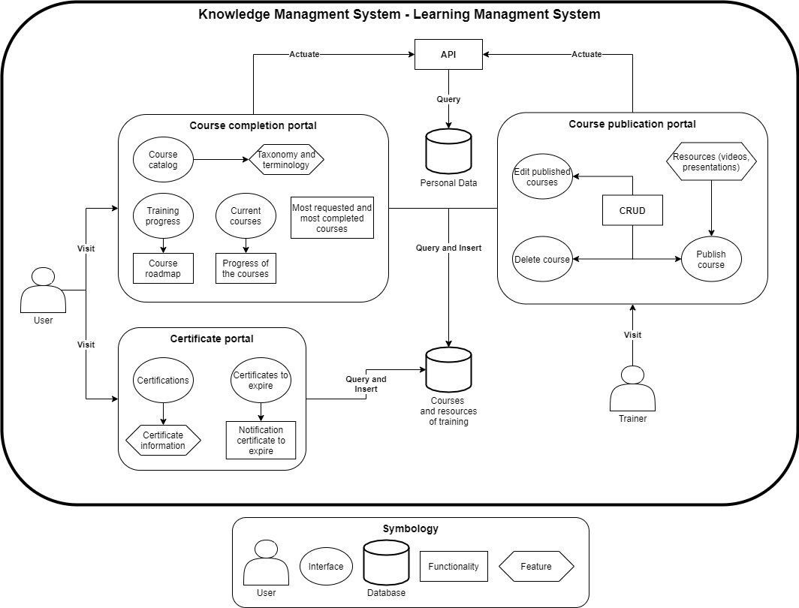

# Introduction

## :trophy: A0.1 Learning activity

## Objective

Perform the context of the case study, as well as a field interview, and finally consolidate the information of the requirements, using the empathize phase proposed by design thinking.

___

## :pencil2:  Development

1. Taking into account the characteristics mentioned on the case study and the design thinking proposal, elaborate context, a list with at least **15 questions directed to the client**, such that they can provide more detailed information to elaborate the requirement analysis about the case study.

    > **Draft idea:**
    

    | No.     | Questions                                                                                  |
    | ------------- |-------------------------------------------------------------------------------------------- |
    | 1 |Currently, Where do you record the certifications that each user has? |
    | 2 |What data would you ike a course to show?|
    | 3 |What data would you like a certification to show? |
    | 4 |What are the file formats used in your company for training and certification of your users?|
    | 5 |Regarding your training material, is there a restriction on the minimum and/or maximum size of your files?, Which one?|
    | 6 |Would you like your users to be able to start more than one course before taking the respective evaluations? Or, Should he perfom the evaluation of the last one before starting another? |
    | 7 |Currently, Do your users have a maximum number of courses that they can take per day?, How many? |
    | 8 |At the moment of the evaluation of yours users, do they have time to perfom the course evaluation?, How much? |
    | 9 |Would you like the user to have a limit of attempts to pass the course? Or, Could the user take the course as many times as needed to pass it? |
    | 10 |If the user fails a course, Would you like the system to allow you to choose the number of opportunities the user has to repeat the evaluation? |
    | 11 |In your company, Is there any system/platform/tool or place of daily use where the user can be notified that their courses are about to expire? Which one(s)? |
    | 12 |Who would you like to be notified when a course or certificate needs to be taken? |
    | 13 |How long in advance do you think it is necessary to give a notification that a certification is going to expire? |
    | 14 |If the user is notified of any recertification, how long do you consider necessary for the user to comply with this notice? |
    | 15 |Do you think it is necessary that the trainers are the only ones who could consult the information of the certifications or could there be an administrative user to manage it? |
    | 16 |Would you like to have a person dedicated to reviewing the content uploaded by trainers for him to approve them? |
    | 17 |We know that you offer practical courses, is there a person in charge of registering the users' certifications in a system? |
    | 18 |In the event that a course needs to be updated, do you consider it necessary for users to recertify, taking into realize that the validity period has not yet expired? |
    | 19 |Would you like that when a user is certified, this certification is printed? |

2. Once the interview mentioned on the last point is completed, use one of the techniques that they propose inside the design thinking empathize fase and you can even use any other tool, technique or artifact to consolidate the information collected through the client and elaborate the **bussiness model proposal of the system to develop**.

    > As a team, we used the “clustering” method of design thinking to consolidate the information collected of the interviews. Once the requierements are identified, they were captured in a “kanban” which we categorize by "epics" that contain their respective requirements (user stories). The result is shown below:
    #### :clipboard: [Link to kanban](https://www.notion.so/dc66ed01617b442c9af2009c3dc9fca0?v=cfff5b770fa0413cb7435dc69cfae689) :bookmark_tabs:

    ##### Diagram example image:
    

3. Prepare and show your document, consider performing the dynamic as you would do a job in a field work, and present to the advisor and your classmates.

4. Include individual conclusions.

    - Cruz Vera Elden Humberto
    > This activity was very interesting because we had to do it in english, so writing down everything was a bit more time consuming. And in my opinion we had a bit of issues while thinking our questions for the interview, they were a bit too specific in some cases and these kind of questions needed to be a bit more general. And the tool that we use to consolidate all of the information was a bit jarring, but i think it was pretty useful to organize everything in a clean manner.

    - Perales Niebla Abner Jesus
    >Personally, I had never heard of Design thinking. And I think it is an excellent process for handling information, as it offers us very useful tips and techniques. In our case, we do not use a Design thinking method to consolidate the information, but rather a Kanban, to better visualize the requirements expressed in user stories, as well as the progress of the development of these requirements.   Also, I am sure that having conducted the interview on more than one occasion and seeing the interviews of our colleagues, allowed us to be very clear about the requirements that we had detected and some that we had not thought about.

    - Piña Meza Oscar Andres
    > The implementation of Design thinking for the interview, the collection of requirements and the consolidation of the information were of help to be able to collect all the necessary data for the development of the work, in addition to the use of methods such as "Separate and group" helped us to better identify user requirements.   The activity was very useful to create skills that will continue to be implemented during the course, I consider that the support of this type of tools and methods applied very well to the case study that we had.

    - Ramirez Cervantes Cesar Manuel
    > Te use of news tools has ever been a tough challenge for me; however design thinking methodology that we use for our analysis preparation of this Project is very easy to understand. As well, I think the use of notion as tool for the documentation it a success for the teamwork with the equipment specially in this situation of covid 19; but i still don’t know how of these functions Works.

    - Morgado Jacome Eduardo
    > I have worked with agile methodologies before but had never heard of design thinking, and this most likely because I used agile scrum for coding, and always leaving aside the first phases of a software development life cycle, which is where design thinking comes into play.   I affirm that the phase of obtaining requirements with the client is the most important, because, although they are open to changes due to methodologies, it is the basis of all development, and if it starts badly, it will end badly. From now on, for software development, I am sure to use these good practices and tools recommended by this framework.

___

### :bomb: Rubric

| Criteria     | Description                                                                                  | Score |
| ------------- | -------------------------------------------------------------------------------------------- | ------- |
| Instructions | Each of the points indicated within the instruction section are fulfilled?            | 10      |  | 5 |
| Development    | Each of the points requested within the development of the activity are answered?     | 60      |
| Demostration  | The student was present during the explanation of the functionality of the activity?            | 20      |
| Conclusions  | Does it include a personal opinion of the activity done by all of the team members? | 10      |

:house: [Go to home](../readme.md)

##### :open_file_folder: [Direct link to the repository on GitHub - Eduardo Morgado Jacome](https://github.com/EduardoMJ99/AnalisisAvanzadoSoft_2021-1) :open_file_folder:

##### :open_file_folder: [Direct link to the repository on GitHub - Abner Jesús Perales Niebla](https://github.com/AbnerPerales19/AnalisisAvanzadoDeSoftware_AbnerPerales) :open_file_folder:

##### :open_file_folder: [Direct link to the repository on GitHub - Elden Humberto Cruz Vera](https://github.com/CruzVeraEldenHumberto/Analisis-Avanzado-de-Software-Cruz-Vera) :open_file_folder:

##### :open_file_folder: [Direct link to the repository on GitHub - Oscar Andes Piña Meza](https://github.com/oscarpm96/Analisis-Avanzado-16210567.git) :open_file_folder:

##### :open_file_folder: [Direct link to the repository on GitHub - Cesar Manuel Ramírez Cervantes](https://github.com/CMRamirezC/Analisis_Avanzado-_Software_Ramirez_Cervantes.git) :open_file_folder: