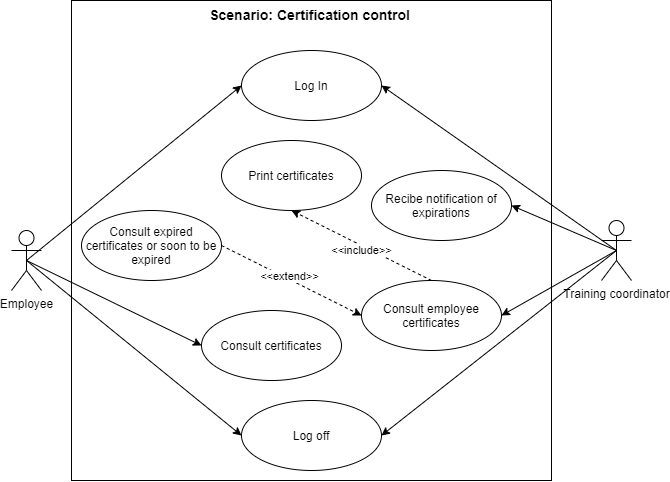
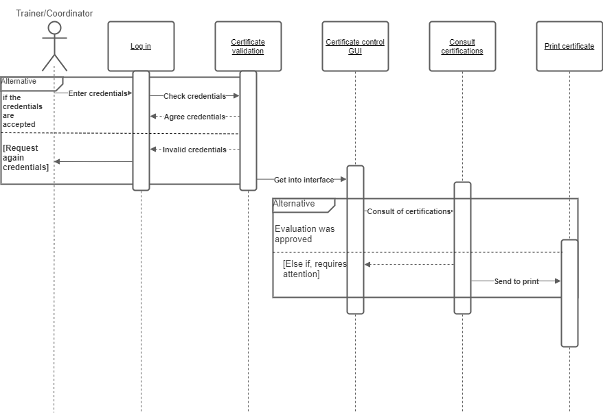
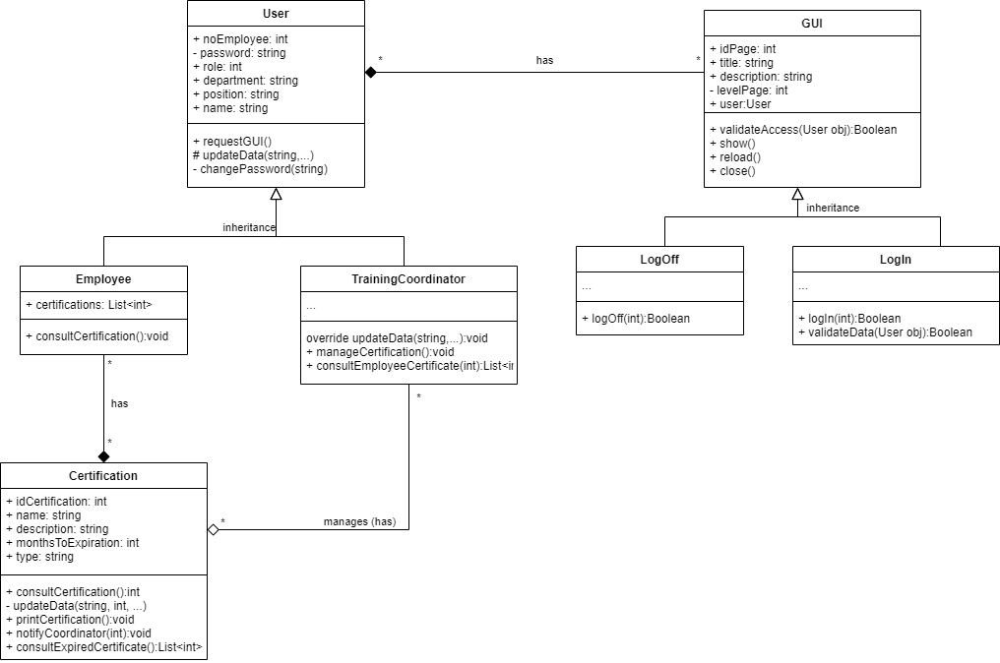
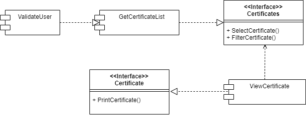
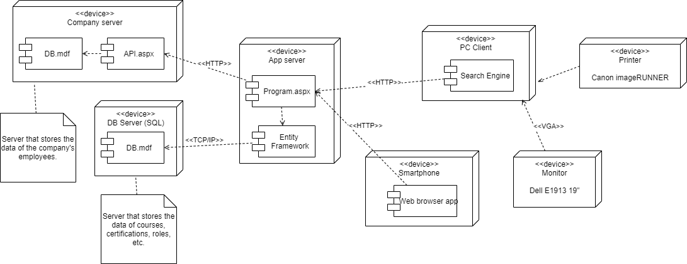

# Introduction

## :trophy: A1.1 Learning activity

Requirements modeling through UML diagrams

---
### :pencil2: Development

1. Based on each of the user and system requirements previously established for the case study, write the requested modeling diagrams:

+ A diagram that contains the relationships between the different **use cases**, only for the scenario in which the user interacts with the system using the main or central functions according to each case study. (Include at least 5 elements of the diagram)

+ The **sequence** diagram that explains the communication between the different GUIs for the use cases of the previous point, considering that the user has already successfully entered the system. (Include at least 5 elements of the diagram)

+ The **class** diagrams for the objects to be instantiated, for the last mentioned points. (Include at least 5 elements of the diagram)

+ A package diagram containing the **component** diagrams and the relationships between the database, user interfaces, controllers, or middle layers - middleware. (Include at least 3 elements of the diagram)

+ The **distribution** diagram representing the physical structure of the system such as physical infrastructure, networks, storage and web servers, firewall, mobile devices or any other physical resource that will be part of the system. (Include at least 3 elements of the diagram)

2. Include individual conclusions.

    - Cruz Vera Elden Humberto
    > In my opinion I feel that at the beginning the activity was a little complicated, because we had not worked all the UML diagrams so thoroughly or using most of its elements, so we had to think very well when developing them. Once we became a little more familiar with them, it wasn't so bad, and it didn't even take us long to translate the content of the activity thanks to the fact that the diagrams didn't have a lot of text.

    - Perales Niebla Abner Jesus
    > In this activity, a user story was chosen to create the diagrams. We chose the one that allowed us to show all the diagrams in a simple and direct way. At first it was difficult to think about the elements that the diagrams would have, but as the ideas arose, each diagram became easier. Something that made the development of the diagrams more complicated were all the elements that compose them, since they have always taught us about UML diagrams in a simple way. And by elaborating them in such detail we realized that they really can contribute more than we imagined and we always underestimate them.

    - Piña Meza Oscar Andres
    > In this activity, a different use case was chosen, taking the certifications as core, the elaboration of the first diagrams was provided to us as a team, but the last diagrams practically none of the members had made them, so it was a bit complicated. , but working as a team facilitated the understanding and realization of the diagrams.   In each activity we are using topics that we got to see in previous semesters but in an even more detailed way.

    - Ramirez Cervantes Cesar Manuel
    > The most complicated to me it's when I started to do the components diagram. I have many problems to determine what or who can be the components, as well, in the interfaces presentation I can't identify what interface will be according the system because this is my first time using this diagram. To me, it's more easier working  with distribution diagrams because they are representing the physical structure of our project when every node interpreting a hardware resource. Now I'm getting inquiries with the others diagrams so, I don't have problems with that.

    - Morgado Jacome Eduardo
    > The fact of working in a team helps to share opinions or different points of view on how to solve a problem, or in this case, how to diagram requirements of a project, in such a way that you can learn advice or techniques from other co-workers. When we made the diagrams we were able to share our ways of diagramming and enrich ourselves to do it in a better way the next time we face the requirements model. For example, I now know that frames can be implemented in sequence diagrams to represent an alternative sequence of events to the main sequence. There is no doubt that the diagramming of project requirements is a long and extremely important task that, if done correctly, can ensure the correct development of a system.S

### :bomb: Rubrica

| Criteria     | Description                                                                                  | Score |
| ------------- | -------------------------------------------------------------------------------------------- | ------- |
| Instructions | Each of the points indicated within the instruction section are fulfilled?            | 10      |  | 5 |
| Development    | Each of the points requested within the development of the activity are answered?     | 60      |
| Demostration  | The student was present during the explanation of the functionality of the activity?            | 20      |
| Conclusions  | Does it include a personal opinion of the activity done by all of the team members? | 10      |

:house: [Go to home](../readme.md)

##### :open_file_folder: [Direct link to the repository on GitHub - Eduardo Morgado Jacome](https://github.com/EduardoMJ99/AnalisisAvanzadoSoft_2021-1) :open_file_folder:

##### :open_file_folder: [Direct link to the repository on GitHub - Abner Jesús Perales Niebla](https://github.com/AbnerPerales19/AnalisisAvanzadoDeSoftware_AbnerPerales) :open_file_folder:

##### :open_file_folder: [Direct link to the repository on GitHub - Elden Humberto Cruz Vera](https://github.com/CruzVeraEldenHumberto/Analisis-Avanzado-de-Software-Cruz-Vera) :open_file_folder:

##### :open_file_folder: [Direct link to the repository on GitHub - Oscar Andes Piña Meza](https://github.com/oscarpm96/Analisis-Avanzado-16210567.git) :open_file_folder:

##### :open_file_folder: [Direct link to the repository on GitHub - Cesar Manuel Ramírez Cervantes](https://github.com/CMRamirezC/Analisis_Avanzado-_Software_Ramirez_Cervantes.git) :open_file_folder: