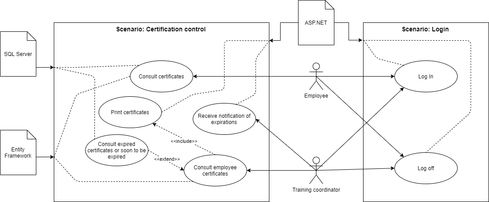
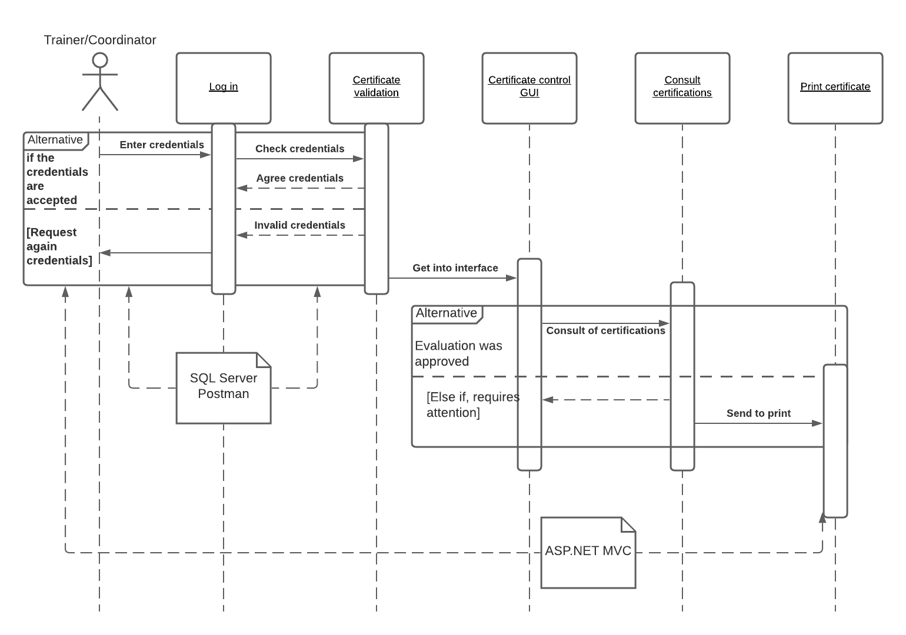
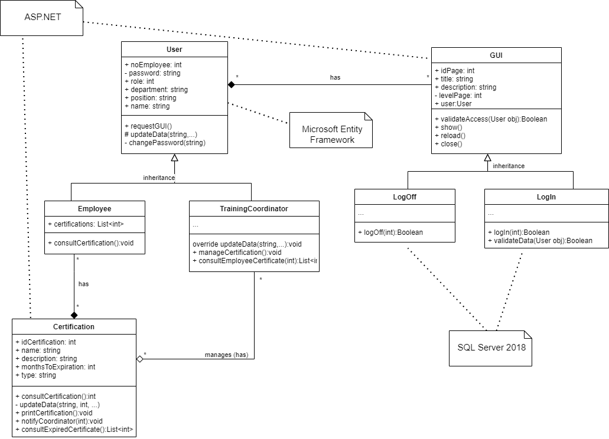
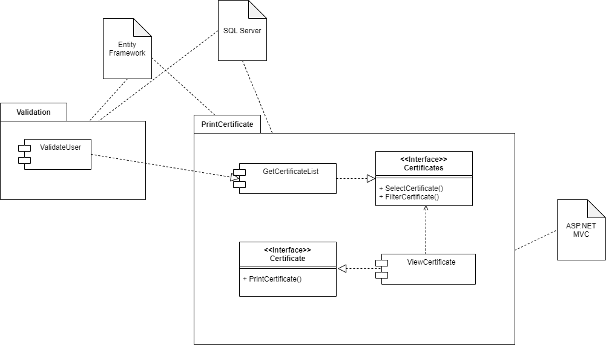
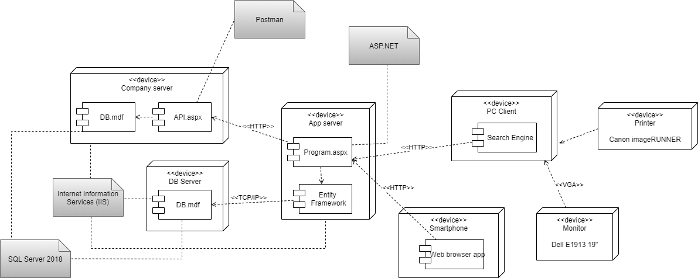

# Introduction

## :trophy: A2.2 Learning activity

- System architecture documentation based on the 4 + 1 model

___

### :pencil2: Development

1. Prepare the diagrams for each of the views established in the 4+1 architecture model.

    - [x] Scenario View: User Case Diagram
    - [x] Logical view: Class diagram
    - [x] Process view: Sequence diagram
    - [x] Developer view: Component diagram
    - [x] Physical view: Distribution diagram

2. Each diagram must contain at least 3 elements within its representation.

   - [x] Use Cases (Include at least 5 diagram elements)
   - [x] Sequence Diagram (Include at least 5 diagram elements)
   - [x] Class Diagrams (Include at least 5 diagram elements)
   - [x] Package Diagram containing component diagrams (Include at least 3 - diagram elements)
   - [x] Distribution diagrams (Include at least 3 diagram elements)
   
3. Indicate by means of annotations the proprietary technologies to be used, supported by images or illustrations that represent them.
##### Scenario View (User Case Diagram)

---
##### Process view (Sequence diagram)

---
##### Logical view (Class diagram)

---
##### Developer view (Component diagram)

---
##### Physical view (Distribution diagram)

---

4. Include individual conclusions.

    - Cruz Vera Elden Humberto
    > In my opinion the activity was simple to perform, in itself we only had to define the technologies to be used in our system and check where it is used by taking into account our architecture design. Something important to consider during the realization of this activity is that besides gathering the diagrams that we already had made, we also had to think about how the technologies that we will consider for the development of the system were related. Fortunately all the diagrams were already in English so we did not take so long with the activity.

    - Perales Niebla Abner Jesus
    > Usually, when I design a diagram for some other class, it is archived and rarely consulted. In contrast, in this class, we not only connect all the diagrams but also establish the technologies with which we will develop those sections of the program. This allows you to link what you visually capture with what you will use in the development phase. This way you can start thinking about whether your development tools are optimal or not.

    - Piña Meza Oscar Andres
    > This activity was relatively easy to carry out, since we had the diagrams already made and in English, we only had to add annotations of which technologies would be implemented in the structure of each diagram, only some if I consider that it was difficult to put only one u  Another technology since we considered something simple, but this will be the way it will be implemented, this activity can be seen visually as the project will develop in a few weeks that we will begin with the construction of the LMS system.

    - Ramirez Cervantes Cesar Manuel
    > In this activity we had already done most of the work, so it was quite simple.   Although I think that personally I had some doubts about the representation of the scenario view because it is suggested to be represented as the use case diagram, but the confusing thing was that I had to relate the other views. In this activity we identified which technologies we will use for the programming of our web application.

    - Morgado Jacome Eduardo
    > In conclusion, I find the modeling of the architecture of the project attractive with this 4 + 1 model since the operation of the entire proposed system is seen in a general way, from the software components to the physical components, which are made for different perspectives, such as developers with the development view, designers with the logic view, and even end users such as the scenario view. In the same way, placing the proposed technologies to be used in the project helped us to know in a clearer way in which part of the project development we should implement each technology and how they communicate with each other.
___

### :bomb: Rubric

| Criteria     | Description                                                                                  | Score |
| ------------- | -------------------------------------------------------------------------------------------- | ------- |
| Instructions | Each of the points indicated within the instruction section are fulfilled?            | 10      |  | 5 |
| Development    | Each of the points requested within the development of the activity are answered?     | 60      |
| Demostration  | The student was present during the explanation of the functionality of the activity?            | 20      |
| Conclusions  | Does it include a personal opinion of the activity done by all of the team members? | 10      |

:house: [Go to home](../README.md)

##### :open_file_folder: [Direct link to the repository on GitHub - Eduardo Morgado Jacome](https://github.com/EduardoMJ99/AnalisisAvanzadoSoft_2021-1) :open_file_folder:

##### :open_file_folder: [Direct link to the repository on GitHub - Abner Jesús Perales Niebla](https://github.com/AbnerPerales19/AnalisisAvanzadoDeSoftware_AbnerPerales) :open_file_folder:

##### :open_file_folder: [Direct link to the repository on GitHub - Elden Humberto Cruz Vera](https://github.com/CruzVeraEldenHumberto/Analisis-Avanzado-de-Software-Cruz-Vera) :open_file_folder:

##### :open_file_folder: [Direct link to the repository on GitHub - Oscar Andes Piña Meza](https://github.com/oscarpm96/Analisis-Avanzado-16210567.git) :open_file_folder:

##### :open_file_folder: [Direct link to the repository on GitHub - Cesar Manuel Ramírez Cervantes](https://github.com/CMRamirezC/Analisis_Avanzado-_Software_Ramirez_Cervantes.git) :open_file_folder: