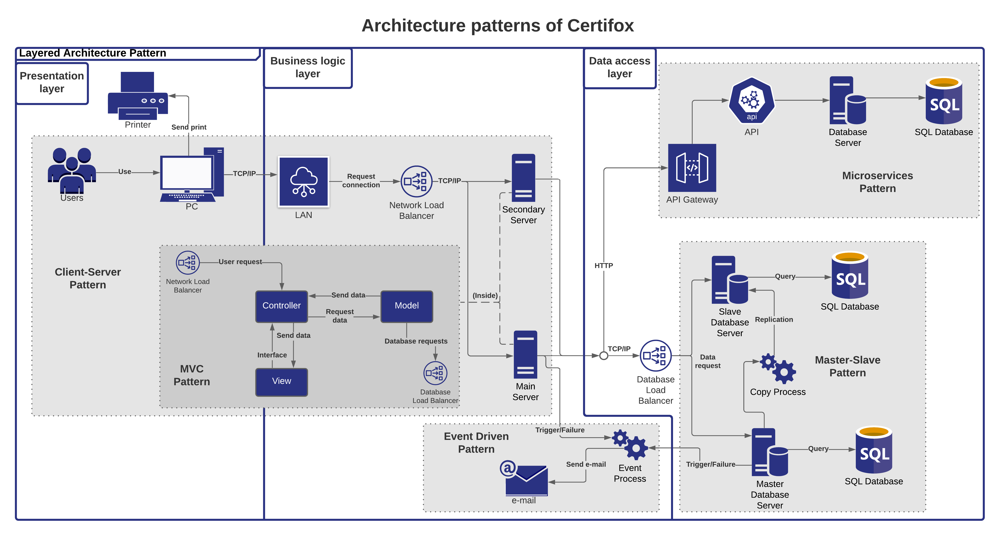

# Introduction

## :trophy: A2.3 Learning activity

- Software architecture patterns
___

### :pencil2: Development

1. Consider applying to the case study the following architectural patterns.
   
   - [x] Client-Server Architecture Pattern
   - [x] Layered Architecture Pattern
   - [x] Model-View-Controller architecture pattern
   - [x] Micro-service oriented architecture pattern
   - [ ] Pipelines and filters architecture pattern
   - [x] Event-driven architecture pattern
   - [ ] Repository or whiteboard architecture pattern
   - [ ] Publisher/subscriber architecture pattern
   - [x] Master-slave architecture pattern
   - [ ] Point-to-point architecture pattern

2. Based on the architectural views as well as the UML diagrams elaborated, apply the pattern you consider the most appropriate for each of the following scenarios.
   
- 2.1 Considering that it is desired to **maintain and scale the system**, we seek to develop the application through the decomposition of small independent and isolated services, which consume an external interface to communicate to a database server.
- 2.2 Since **confidentiality and security** are attributes or requirements for the case study, the aim is to structure each of the components to be programmed in groups of sub-tasks, where each of these sub-tasks must communicate with an intermediate layer and this to another upper layer.
- 2.3 Looking for the **availability** of the system, it is proposed to install two service servers, where these make their requests to a third server in which the database would be stored.
- 2.4 Identifying that data **integrity** is a requirement, it is proposed to replicate and synchronize the database stored in the main server to another one, considering the main server as master and the secondary one as slave.
- 2.5 Considering that the client requested that every time a failure occurs, **alarms** should be provided to the different users regardless of their location, it is noted that a service provider should be contracted to trigger the alarms and these will reach the required users.

#### Architecture pattern diagram for the above scenarios:

##### :chart: [Web link to see the diagram with higher resolution.](https://lucid.app/documents/view/1084c540-aeaf-4a27-9de3-681ba074d6eb)

3. Include individual conclusions.

    - Cruz Vera Elden Humberto
    > During this activity we quickly identified the architectural patterns to be used in our case study as the scenarios mentioned in the second point. Something that was complicated was to analyze how these patterns relate to each other for the operation of our system and to make sense within the diagram we made. In my opinion it was a very complete activity in which we were able to use all the patterns in a satisfactory way.

    - Perales Niebla Abner Jesus
    > For this activity we had to analyze part by part the instructions in order to perform it correctly. First we identified all the patterns that we considered appropriate for each of the points. Then we made the diagram satisfying the instructions for each of the points, including the pattern for each point. At the end, we included the relationships between the icons, as well as rearranging some patterns.

    - Piña Meza Oscar Andres
    > This activity helped us to identify the software architecture patterns in our project, firstly knowing them and also knowing which ones we are working with thanks to the explanation of the classes, we used the patterns that were adapted to each case study and each use case, also relating to a diagram how to work with each one of them in the development of the entire use case. In my case I had not worked with these case studies, it helped me to know and that I will work with them in the future.

    - Ramirez Cervantes Cesar Manuel
    > For this activity we reinforce what we learned with the architecture patterns class, we identify which patterns can be applied to our project. Using as a guide the cases presented in the activity, where we represent them with specific architectural patterns that meet the requested objective.   Taking into account that we have little experience making diagrams, we carried out the activity with a smooth progress, achieving a very clear understanding of the topic of architectural patterns.

    - Morgado Jacome Eduardo
    > Before receiving this class I knew only a few architecture patterns so when I thought about which one to use in a project I always used the same ones no matter the case, but now once I have seen many more and I have seen the quality attributes that better manage each of them can better diversify an architecture diagram of a project. Thinking about which architecture pattern was best suited to the scenarios raised in the activity was really a challenge because we all have different ideas but this conflict helped us to understand them even better and be sure that the ones we plan to implement meet the case study to be developed.
___

### :bomb: Rubric

| Criteria     | Description                                                                                  | Score |
| ------------- | -------------------------------------------------------------------------------------------- | ------- |
| Instructions | Each of the points indicated within the instruction section are fulfilled?            | 10      |  | 5 |
| Development    | Each of the points requested within the development of the activity are answered?     | 60      |
| Demostration  | The student was present during the explanation of the functionality of the activity?            | 20      |
| Conclusions  | Does it include a personal opinion of the activity done by all of the team members? | 10      |

:house: [Go to home](../README.md)

##### :open_file_folder: [Direct link to the repository on GitHub - Eduardo Morgado Jacome](https://github.com/EduardoMJ99/AnalisisAvanzadoSoft_2021-1) :open_file_folder:

##### :open_file_folder: [Direct link to the repository on GitHub - Abner Jesús Perales Niebla](https://github.com/AbnerPerales19/AnalisisAvanzadoDeSoftware_AbnerPerales) :open_file_folder:

##### :open_file_folder: [Direct link to the repository on GitHub - Elden Humberto Cruz Vera](https://github.com/CruzVeraEldenHumberto/Analisis-Avanzado-de-Software-Cruz-Vera) :open_file_folder:

##### :open_file_folder: [Direct link to the repository on GitHub - Oscar Andes Piña Meza](https://github.com/oscarpm96/Analisis-Avanzado-16210567.git) :open_file_folder:

##### :open_file_folder: [Direct link to the repository on GitHub - Cesar Manuel Ramírez Cervantes](https://github.com/CMRamirezC/Analisis_Avanzado-_Software_Ramirez_Cervantes.git) :open_file_folder: