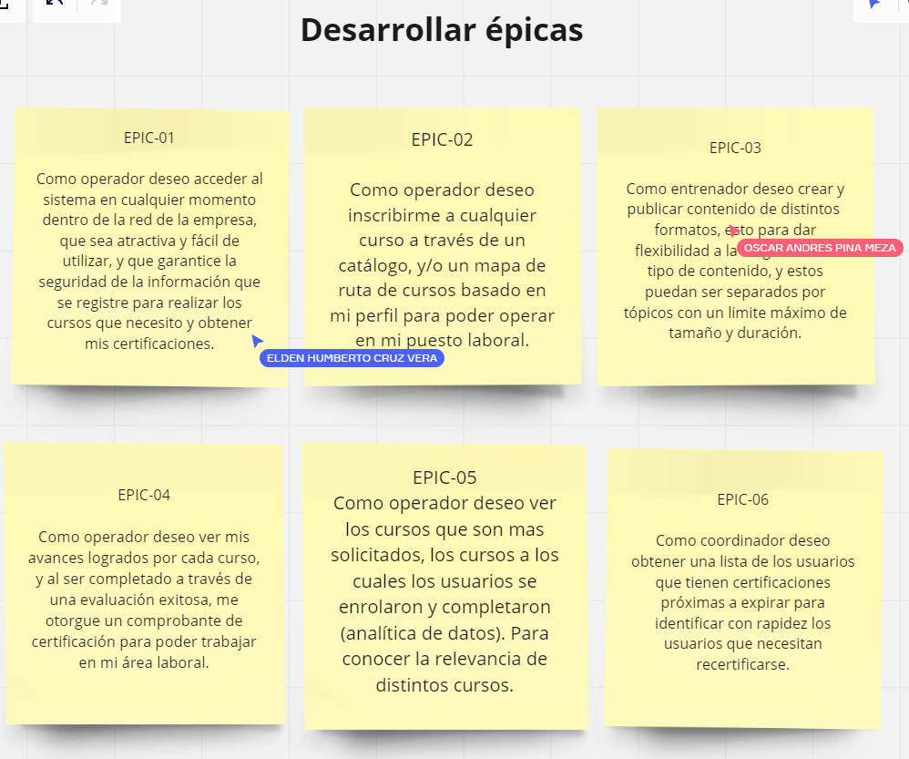
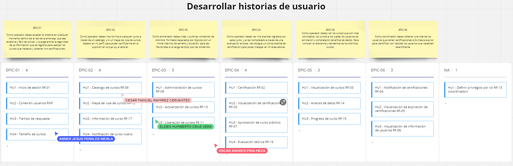
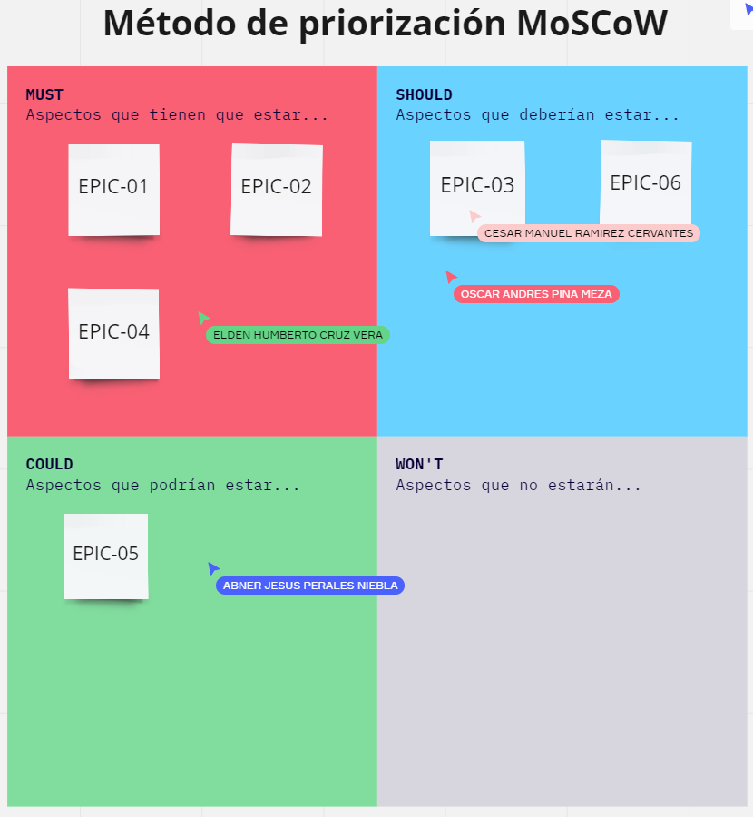
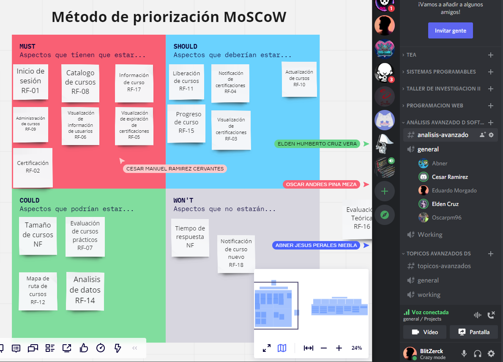
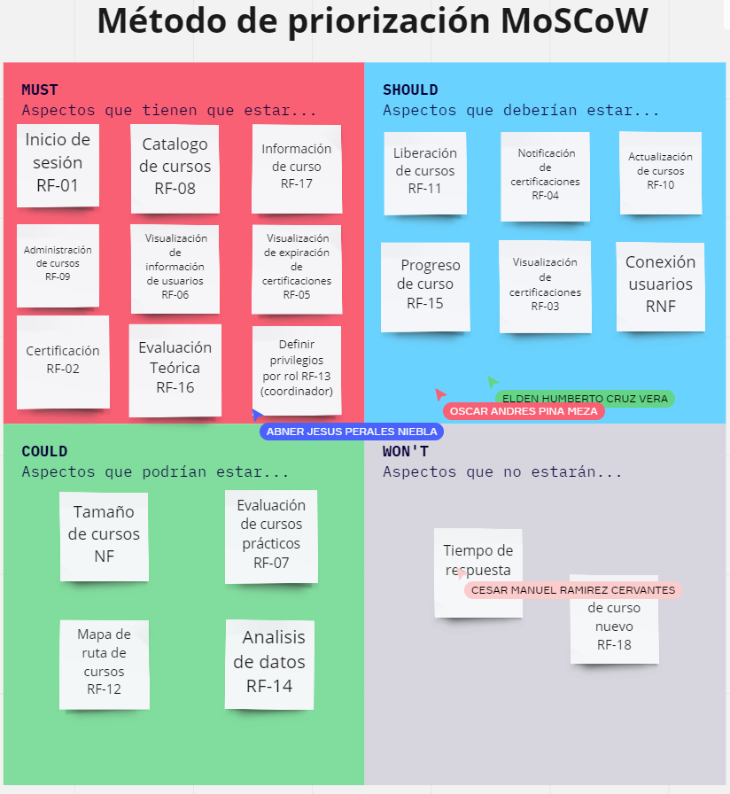
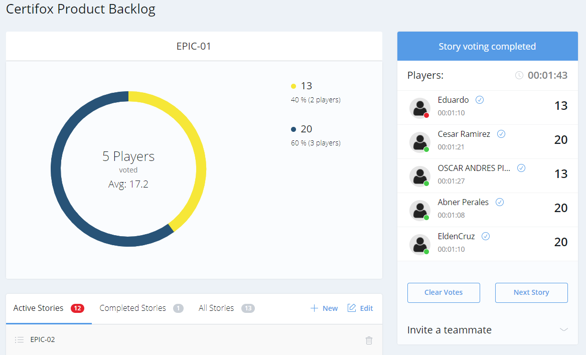
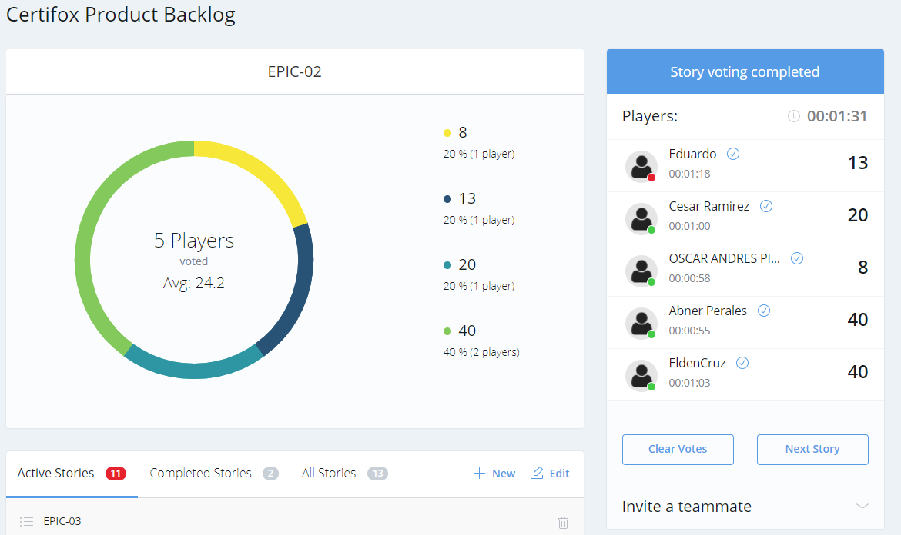
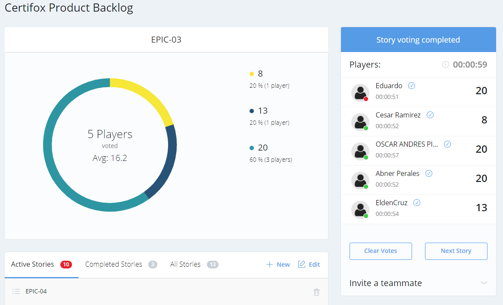
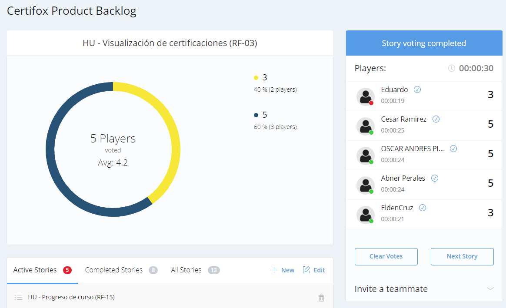
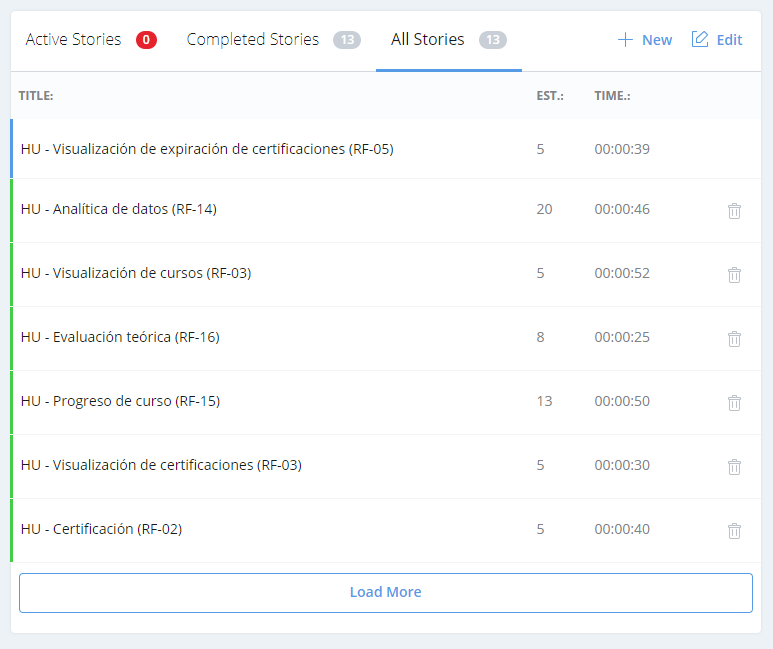

# Introduction

## :trophy: A3.1 Learning activity

Initial phase of the SCRUM framework for the case study.

---

### :pencil2: Development

1. Join your work team and start preparing what is requested below:
   - [x] 1.1 Create a scrum board with Backlog, Story, To-do, Doing, Review, Done columns.
   - [x] 1.2 Develop the Epics of the product backlog.
   - [x] 1.3 Create user stories for each epic.
   - [x] 1.4 Place every epic and user story inside the scrum board.
   - [x] 1.5 Prioritize and estimate each user story using one tool.

    ##### Product backlog
    ###### :page_facing_up: [Web link to the product backlog](https://e-smt.atlassian.net/l/c/AkA1WNHE)
    ###### :open_file_folder: [Local link to the product backlog](../pdf/ProductBacklog.pdf)

    ##### Scrum board
    ###### :page_facing_up: [Web link to the scrum board](https://miro.com/app/board/o9J_l_LEGCk=/)
    ###### :open_file_folder: [Local link to the scrum board](../pdf/ScrumBoard.pdf)

2. Present this information during the planning meeting, making use of visual and graphic tools, which can be through any online platform.

3. Place in this section evidence that shows that they were gathered to develop the activity as a team.

4. Include individual conclusions.

    - Cruz Vera Elden Humberto
    > In my opinion this activity was quite complex for a couple of reasons. We had to hold a couple of meetings in order to agree on the prioritization and estimation of epics and user stories and we required some time to develop the product backlog and to be able to properly organize our epics and user stories. Not to mention the fact that we also had to translate all the work into English. I was struck by the different tools and methods used to carry out the SCRUM development methodology.

    - Perales Niebla Abner Jesus
    > For this activity we use a web page to perform the estimation of epics and user stories. I really liked this tool, as everyone provides their point of view in scores in a visual way and it gives you an average of how difficult we think it will be. Another thing that helped a lot in the estimation, was to set an example, we set an activity that we had already done in some other project and we set a score for it. Then when we wanted to choose, we only had to think about whether it was more or less difficult than the model activity and so it was easier to choose the estimate. Likewise, we used a model proposed in class for the prioritization of epics and user stories, which helped us a lot to determine what we should give more importance to.  Thanks to this, we realized many things that we considered very important but that in the end were less necessary than others.

    - Piña Meza Oscar Andres
    > I found this activity a bit complicated because there were many sections to review, but I consider that some of them were very useful such as estimates and user stories, sometimes I consider that so much documentation and analysis is too much, but I do not consider it unnecessary. Estimating the stories and epics seemed to me a good practice to see that we are all in the same channel, and also to have a second point of view in which to consider the complexity of each one, in this activity I met several tools to manage the Scrum framework such as Miro and Planing Pocket, this type of activities I had already worked but never with the ease that these tools gives us.

    - Ramirez Cervantes Cesar Manuel
    > For this practice, the highlights were the dynamics we used to prioritize our epics and user stories, where we noticed that in some cases we did have different opinions on the value we gave to the priority of each of the epics and user stories. However, in the case of Moscow's prioritization method we had conflicts because in our way of visualizing the project, we did not consider that any epic or user story should be left out of the project, so we really did not know which one to add in the Won't section.

    - Morgado Jacome Eduardo
    > In conclusion, I really enjoyed this activity, but especially the estimation and prioritization of the user stories because sharing different points of view with your team about what functionality gives more weight to the final product, why, and how long it is estimated to take to complete it, makes you see details that perhaps you had not contemplated, to such an extent that you even change your mind because there is a better understanding of what the customer wants.   Actually as a team we did not have very different ideas, almost in all the estimates we were in an acceptable range but we always discussed why, making us refer better the results improving the product backlog. In the prioritization of the features we really had no problem, we all said our criteria and in the end we came to the same conclusion, creating a product backlog that gives value to the product.
___

### :bomb: Rubric

| Criteria     | Description                                                                                  | Score |
| ------------- | -------------------------------------------------------------------------------------------- | ------- |
| Instructions | Each of the points indicated within the instruction section are fulfilled?            | 10      |  | 5 |
| Development    | Each of the points requested within the development of the activity are answered?     | 60      |
| Demostration  | The student was present during the explanation of the functionality of the activity?            | 20      |
| Conclusions  | Does it include a personal opinion of the activity done by all of the team members? | 10      |

:house: [Go to home](../README.md)

##### :open_file_folder: [Direct link to the repository on GitHub - Eduardo Morgado Jacome](https://github.com/EduardoMJ99/AnalisisAvanzadoSoft_2021-1) :open_file_folder:

##### :open_file_folder: [Direct link to the repository on GitHub - Abner Jesús Perales Niebla](https://github.com/AbnerPerales19/AnalisisAvanzadoDeSoftware_AbnerPerales) :open_file_folder:

##### :open_file_folder: [Direct link to the repository on GitHub - Elden Humberto Cruz Vera](https://github.com/CruzVeraEldenHumberto/Analisis-Avanzado-de-Software-Cruz-Vera) :open_file_folder:

##### :open_file_folder: [Direct link to the repository on GitHub - Oscar Andes Piña Meza](https://github.com/oscarpm96/Analisis-Avanzado-16210567.git) :open_file_folder:

##### :open_file_folder: [Direct link to the repository on GitHub - Cesar Manuel Ramírez Cervantes](https://github.com/CMRamirezC/Analisis_Avanzado-_Software_Ramirez_Cervantes.git) :open_file_folder: