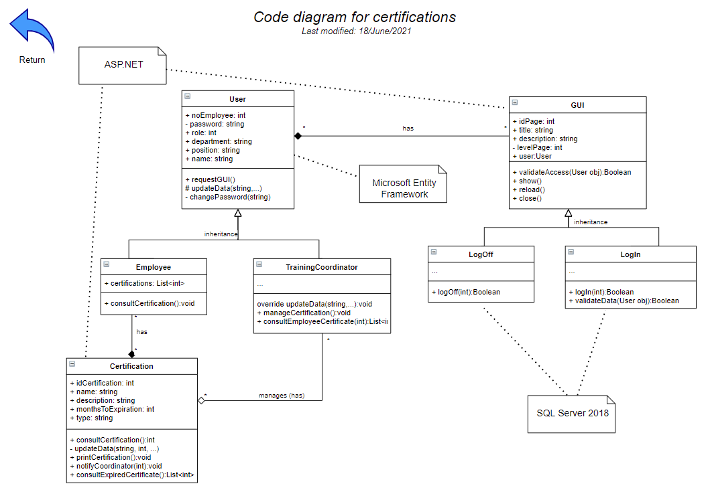

# Introduction

## :trophy: A3.1 Learning activity

Software architecture design using C4 model

---

### :pencil2: Development

1. Create the following diagrams for the case study:

   #### :page_facing_up: [Web link to the interactive C4 Model ](https://e-smt.atlassian.net/l/c/04xyzZFv)

   - [x] 1. Context diagram.
   
   - [x] 2. Containers diagram.
   
   - [x] 3. Components diagram.
   

   ---
   

   ---
   

   ---
   
   - [x] 4. Class diagram
   

2. Include individual conclusions.

   - Cruz Vera Elden Humberto
    > In my opinion it was a rather complicated activity, since at least I have never worked with the C4 model, although some of my teammates had worked with it. When developing the model a couple of details arose due to our inexperience with it, which in fact were mentioned during the class since we were practically making a mixture of different models. In the same way, this activity serves as experience in case we need to develop a C4 model at some point in the future.

    - Perales Niebla Abner Jesus
    > In this activity we developed a diagram that most of us had not developed. And, when you do something new, it's hard to get it completely right the first time. But it was largely done correctly. Also, those of us who had already done this diagram had had no guidance in the development, so we were practically going in blind. However, after the teacher's documentation and especially his feedback, both with us and the other teams, we realized some things that were going wrong. We corrected them and now we learned how to make C4 models. Something I would like to comment is that I really liked the Draw.io tool when it comes to putting links between components, it is very useful.

    - Piña Meza Oscar Andres
    > In this activity we sought to develop a C4 model to develop all the blocks for each type of user. We worked together to develop each block and its components, reaching only to the classes, since we consider that its development was not required. We consider that the objective was achieved even though the deployment of each element was complicated and laborious, we believe that it is necessary for the initial phase of the project, so that users with technical or business understanding can have a clear idea of the process. With this activity we learned how to develop this type of models and also gave us to understand the need for it, I particularly liked using the drawio embedded tool, I think it is very useful in this type of models especially in the zoom functionality.

    - Ramirez Cervantes Cesar Manuel
    > For this activity I think that despite the short time we had to develop it, the result was quite good, leaving the container and component diagrams well laid out. However with the class diagram it was different because we really did not have very clear where we could apply each of the classes that this diagram had. At the end if we did it but I still had some doubts, but being these very minimal because the greater weight of retains in the diagrams of containers and components.

    - Morgado Jacome Eduardo
    > Previously I had already worked with the C4 model and I have always found it interesting and better than the UML diagramming, although it is clear that they offer a different perspective of the proposed system to develop, where the C4 model seems to me more "agile" and therefore more in line with an agile methodology such as scrum. The information shown by the consultant on this topic seemed to me good and very useful, and this was corroborated at the time of performing the activity as a team, since the whole team supported the activity even though some members had no experience with this type of diagramming.   The elaboration of the activity helped me to rescue details that I had already forgotten about the C4 model, such as that in the first level diagram (context) should be placed in gray color the existing systems that are related to the proposed system to be developed.

___

### :bomb: Rubric

| Criteria     | Description                                                                                  | Score |
| ------------- | -------------------------------------------------------------------------------------------- | ------- |
| Instructions | Each of the points indicated within the instruction section are fulfilled?            | 10      |  | 5 |
| Development    | Each of the points requested within the development of the activity are answered?     | 60      |
| Demostration  | The student was present during the explanation of the functionality of the activity?            | 20      |
| Conclusions  | Does it include a personal opinion of the activity done by all of the team members? | 10      |

:house: [Go to home](../README.md)

##### :open_file_folder: [Direct link to the repository on GitHub - Eduardo Morgado Jacome](https://github.com/EduardoMJ99/AnalisisAvanzadoSoft_2021-1) :open_file_folder:

##### :open_file_folder: [Direct link to the repository on GitHub - Abner Jesús Perales Niebla](https://github.com/AbnerPerales19/AnalisisAvanzadoDeSoftware_AbnerPerales) :open_file_folder:

##### :open_file_folder: [Direct link to the repository on GitHub - Elden Humberto Cruz Vera](https://github.com/CruzVeraEldenHumberto/Analisis-Avanzado-de-Software-Cruz-Vera) :open_file_folder:

##### :open_file_folder: [Direct link to the repository on GitHub - Oscar Andes Piña Meza](https://github.com/oscarpm96/Analisis-Avanzado-16210567.git) :open_file_folder:

##### :open_file_folder: [Direct link to the repository on GitHub - Cesar Manuel Ramírez Cervantes](https://github.com/CMRamirezC/Analisis_Avanzado-_Software_Ramirez_Cervantes.git) :open_file_folder: